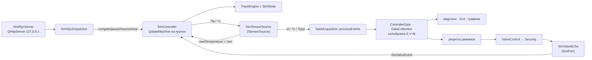
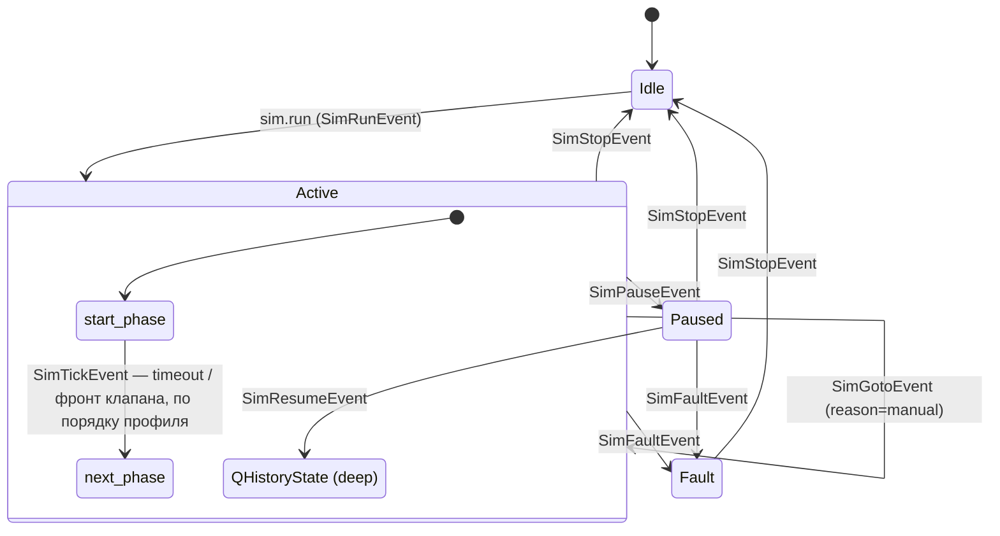

# Демо-данные датчиков (демо-режим GRAMs)

Демо-режим подменяет показания датчиков и порт клапанов, поэтому режимы (в первую
очередь «Вакуум») работают без стенда. Показания задаёт **профиль**: фазы,
ключевые точки и интерполяция. Профиль исполняет машина `QStateMachine`, а
управляет ею gram-db-viewer по JSON-RPC. Режимы, `Security` и квартили о демо не
знают: подмена сделана ниже них.

Контракт RPC и формат профиля описаны в [`rpc-contract.md`](rpc-contract.md).

## Запуск

```powershell
# без подключённого железа: плат Advantech из профиля и портов ДВ301/ДВ302
.\build\src\GRAMs.exe --sim                       # RPC на 127.0.0.1:8770
.\build\src\GRAMs.exe --sim --sim-rpc-port 8779 --sim-token s3cret
$env:GRAMS_SIM = "1"; .\build\src\GRAMs.exe       # то же через окружение

.\tools\sim_rpc_smoke.ps1 -Port 8770              # дымовая проверка RPC
```

| Флаг | Переменная окружения | По умолчанию |
|---|---|---|
| `--sim` | `GRAMS_SIM=1` | выключено |
| `--sim-rpc-port <n>` | `GRAMS_SIM_RPC_PORT` | 8770 |
| `--sim-token <t>` | `GRAMS_SIM_TOKEN` | нет (заголовок не проверяется) |

У флагов командной строки приоритет над окружением. Если порт указан неверно,
демо-режим не включается, а причина пишется в лог.

Запускать нужно из корня репозитория, как и обычно: GRAMs читает папку `profile/`
из рабочей директории.

## Когда демо разрешено

| Условие | Что происходит |
|---|---|
| Нет `--sim` | Ничего из `src/sim/` не создаётся, порт не открывается |
| `--sim` и нет железа | RPC поднят, источник данных и клапаны подменены, на экране плашка |
| `--sim` и есть железо | RPC поднят и на управляющие методы отвечает `SIM_NOT_ALLOWED` с причиной. Путь к железу не трогается. Обхода нет |

«Железо есть» (`Initialize::hardwareDetected`) означает, что видна плата
Advantech из профиля (USB-4716/4718/4750) **или** порт ДВ301/ДВ302 из профиля.
Это строже, чем `!isInitializeOk()`: живая плата клапанов при недостающем
COM-порту запрещает демо. Виртуальные `DemoDevice` из DAQNavi к железу не
относятся.

Если на Windows нет `biodaq.dll`, `Initialize` больше не падает: библиотеку
сначала проверяет `LoadLibrary`, и только потом вызывается SDK.

## Схема



### Точка подмены

Подменяются драйверные члены `DataAcquisition`: интерфейс
`controllers/ISensorSource.h`, настоящая реализация `RealSensorSource`, демо —
`sim::SimSensorSource`. Выше этой границы путь данных тот же, что с железом:

| Уровень | Настоящие данные | Демо |
|---|---|---|
| Драйвер | `AdvantechBuff` (фильтр Калмана), `AdvantechAI`, `VacuumController` / `TurboVacuumController` | `SimSensorSource` |
| Единицы на выходе | В (4–20 мА на шунте R), °C, Торр + `Quality` | те же: обратный перевод в `hw/SensorInverse` |
| `DataAcquisition::processEvents` | без изменений | без изменений |
| `ControllerData::addValue` → бар / °C | калибровка `(A/R·1000)·V + B` | та же |
| Квартили, GUI, `GasLeakage`, рецепты | без изменений | без изменений |

Почему именно здесь:

- **Выше** (писать бары прямо в `ControllerData` или подменять лямбды рецептов)
  обходится калибровка и остаются пустыми 128-точечные буферы
  `runSupplyAction` / `fillLeakageRQ`. Лямбды к тому же служат швами тестов.
- **Ниже** (эмулировать плату или COM-порт) понадобились бы biodaq, поток SDK и
  двоичный протокол вакуумметра, а выигрыша по идентичности пути нет.

Детали, сохранённые как у настоящих приборов:

- давление видно со следующего опроса: `readPressure` обновляет секцию после
  чтения;
- вакуумметры выше 761 Торр отдают `OverRange` с 761;
- «отфильтрованные» напряжения подаются без прогона через фильтр Калмана:
  переходный процесс фильтра исказил бы форму профиля.

Такт машины — `SimSensorSource::readTemperature`: его `processEvents` вызывает
каждый опрос (500 мс), даже в режиме быстрого чтения давления. Отдельного
таймера нет.

### Клапаны

У клапанов нет датчиков положения: `ValveControl::confirmValve` перечитывает
регистр-защёлку выхода платы. Демо-порт `SimValveEcho` (`controllers/IDoPort.h`)
возвращает последнюю записанную маску, то есть семантика та же, и проверка
REQ-082 не ослабляется. Каждый изменившийся бит уходит в машину фронтом
(`SimValveEvent`). `Security` о демо не знает: интерлоки (в том числе К176⇄К179)
и правила давления работают на демо-порту так же, как на плате.

**Переход по клапану срабатывает на фронт, а не на уровень.** Клапан, открытый
до `sim.run` (машина в `Idle`) или до входа в фазу, которая ждёт его открытия,
переход не запускает. Нужно закрыть клапан и открыть снова. Тест —
`SimValves.ValveOpenedBeforeRunDoesNotSwitchPhase`.

Правила давления в `Security` используют давления квартилей, которые
`Grams::softEvent` передаёт каждый такт. Открыть S4, R4 или AR4 можно только при
достоверном давлении квартиля. До первого такта после запуска и при
недостоверном показании эти клапаны отклоняются с причиной `pressure_invalid`.
Недостоверным показание считается, если:

- нет нового отсчёта дольше `security.pressureStaleTicks` тактов;
- значение NaN;
- значение вне диапазона датчика (3,8…20,5 мА по калибровке профиля).

На демо-данных это означает, что профиль должен держать DD311/DD312/DD331/DD332
в диапазоне их шкалы.

### Лог пути клапана

```powershell
$env:QT_LOGGING_RULES = "grams.valves.debug=true;grams.security.debug=true;grams.sim.valves.debug=true"
.\build\src\GRAMs.exe --sim
```

| Категория | Что пишет |
|---|---|
| `grams.valves` | запрос (GUI или режим), итог, маска и результат записи в порт, откат, расхождение `confirmValve`, размер реестра при `setDoPort` |
| `grams.security` | отказ с кодом (`interlock` с открытыми клапанами, `pressure_range`, `pressure_invalid` с пояснением), нарушения и предупреждения `checkPressure` |
| `grams.sim.valves` | фронт эха и судьба `SimValveEvent` («→ без события (Idle)», если прогон не запущен) |

GRAMs пишет лог через свой обработчик в `data/GRAMs-log.txt`. У тестов на
Windows при перенаправленном выводе лог виден только с `QT_FORCE_STDERR_LOGGING=1`.

## Машина состояний



- Машина `QStateMachine` строится **на каждый прогон**: граф фаз задаёт профиль,
  а менять состояния работающей машины небезопасно. `Idle` означает, что машины
  нет. Остановка ведёт в `QFinalState`, после чего машина удаляется.
- Команды RPC попадают в машину только через `postEvent`. Такт, фронт клапана,
  goto, пауза, продолжение, остановка и отказ — пользовательские `QEvent`
  (`core/SimEvents.h`).
- Отдельного `SimTimeoutEvent` нет. Таймаут и фронт клапана проверяются
  переходами фазы на одном `SimTickEvent`, в порядке профиля: так соблюдается
  правило «срабатывает первый подходящий». Фронт, пришедший между тактами,
  запоминается в фазе и сбрасывается при входе в новую фазу.
- На паузе время фазы стоит, значения удерживаются, шум заморожен. Продолжение
  через `QHistoryState` возвращает ту же фазу с тем же `elapsedSec`, без новой
  записи в `history`. `sim.goto` на паузе переходит в фазу и оставляет прогон на
  паузе.
- `sim.stop` оставляет каналы на последних значениях.
- Подклассов фаз по виду нет: `static`, `pumping`, `gasInlet` и `h2Inlet`
  отличаются только умолчанием интерполяции и правилами проверки (`SimProfile`),
  поведение в работе одинаковое.

## Хранилище: демо отдельно от эксперимента

В демо-режиме:

- журнал прогонов пишется в `data/sim/regime_log.db` (`RegimeTaskTree::setLogDatabasePath`);
- снимки объёмов читаются и пишутся в базу PostgreSQL **`gramstate_sim`**
  (`GramStateDB::setDatabaseName`). Если такой базы нет, GRAMs работает без неё,
  как и без PostgreSQL. Чтобы viewer видел демо-снимки, базу создают с той же
  таблицей `gramstate`.

Не разделены: CSV «Напуска» и «Натекания» (`data/supplyData`, `data/leakageData`)
и `data/GRAMs-log.txt`. Пути CSV зашиты в `SupplyPort` и `GasLeakage` (квартили),
а их правка вне рамок задачи; открытые вопросы перечислены в
[`rpc-contract.md`](rpc-contract.md#вопросы-к-контракту-и-открытые-вопросы).

## Код

| Файл | Что делает |
|---|---|
| `src/sim/core/TrackEngine`, `SimNoise` | Интерполяция step/linear/log/exp; шум Бокса–Мюллера поверх `mt19937_64`, одинаковый на MSVC и GCC |
| `src/sim/core/SimProfile` | Разбор и проверка `grams.sim.profile/1`, коды Issue |
| `src/sim/core/SimCatalog` | Каналы, клапаны и участки из профиля установки |
| `src/sim/core/SimController`, `SimStates`, `SimEvents`, `SimClock` | Машина фаз |
| `src/sim/rpc/SimRpcDispatcher`, `SimRpcServer` | JSON-RPC 2.0 через HTTP |
| `src/sim/hw/SimSensorSource`, `SimValveEcho`, `SensorInverse` | Подмена источника данных и порта клапанов |
| `src/sim/app/SimOptions`, `SimSubsystem` | Флаги, сборка подсистемы, мост для QML |
| `src/controllers/ISensorSource.h`, `RealSensorSource.h`, `IDoPort.h`, `RealDoPort.h` | Интерфейсы и настоящие реализации |
| `src/qml/sim/DemoDataBanner.qml` | Плашка «ДЕМО-ДАННЫЕ» (через `Loader` в `Main.qml`) |
| `tests/sim/profiles/` | Эталонные профили и фикстуры ошибок |
| `tools/sim_rpc_smoke.ps1` | Дымовая проверка RPC |

## Тесты

```powershell
Push-Location build; ctest --output-on-failure; Pop-Location
.\build\src\sim\tests\SimTests.exe --gtest_filter=SimMachine*
# интеграционный — из корня репозитория (нужна папка profile/)
.\build\src\sim\tests\SimIntegrationTests.exe
```

| Сюита | Что проверяет |
|---|---|
| `SimTests` | TrackEngine, SimNoise, все коды валидации на фикстурах, машина фаз (timeout, фронт, порядок, goto, пауза, остановка, отказ, эталонные профили), RPC через `QTcpSocket`, обратный перевод через настоящий `ControllerData`, `SimValveEcho`, `SimOptions` |
| `SimIntegrationTests` · `SimValves` | Щелчок на мнемосхеме (AR2→K109, R3→K151) до смены фазы профиля; интерлоки на фактическом состоянии (отказ записи, клапан открыт на плате при старте, readback); «Тест клапанов» держит клапан всю выдержку и при настоящем нарушении останавливается, не открывая следующий шаг; `RegimeWorkerBase`; правила давления (`pressure_invalid` / `pressure_range`, устаревание, NaN, диапазон датчика, однократное предупреждение); щелчок без порта не роняет процесс; «фронт, не уровень» |
| `SimIntegrationTests` · `SimVacuumIntegration` | Настоящие `DataAcquisition`, `ValveControl`, `Security` и рецепт «Вакуума» на демо-данных; давления квартилей подаются в `Security`, как в `softEvent`. `vacuum_fore_turbo` доходит до конца через переход на К179. На `vacuum_leak` рост ДВ302 вызывает откат на форвакуум (`turboFallback`), как требует ТЗ. Время ускорено часами, 1 такт рецепта (10 мс) равен 1 с; контекст рецепта собирает тест (решение Р2) |

## Проверено и не проверено

- Приложение с `--sim` на машине без плат: RPC отвечает, прогон идёт по тактам
  опроса, `tools/sim_rpc_smoke.ps1` проходит; без `--sim` порт не открыт.
- Плашка QML визуально не проверялась: в `claude-dev` `Main.qml` не грузится
  из-за `import com.grams.prototable 1.0` в `RegimeSetup.qml`. Незакоммиченная
  правка основной копии это исправляет.
- **Не проверено на стенде:** перенос драйверов за `ISensorSource` / `IDoPort`
  (коммиты `refactor(daq)` и `refactor(valves)`) меняет путь данных с железом.
  До слияния нужен прогон на стенде.
- **Клапаны, 17.09.2026.** Путь «щелчок → Security → эхо → GUI → машина фаз» и
  «Тест клапанов» проверены тестами `SimValves`. Найдено и исправлено восемь
  дефектов, общих для демо и стенда. Список — в
  `Notes/Day12/2026-09-17-security-клапаны-итоги.md`:
  - `checkValvePressure` считал нарушением любой закрытый клапан, поэтому «Тест клапанов» и «Режим в/г» останавливались на первом такте;
  - после аварии «Тест клапанов» открывал следующий шаг;
  - интерлок смотрел на свою копию состояний и не видел клапан, открытый на плате при старте;
  - `setPressureMap` не был реализован;
  - кнопки мнемосхемы рвали привязку к `guiValve`;
  - щелчок без порта ронял процесс.
- **Проверено вживую:** GRAMs `--sim` стартует, порт эха ставится на 16 клапанов, MnemoBase загружается без ошибок QML.
- **Не проверено вживую:** щелчок на мнемосхеме и «Тест клапанов» из RunTable в запущенном GUI (только тесты), а также все правки клапанов на стенде — см. этап 8.3 плана проверки.
- **Порог `cond_gasRelease = 55` бар выше диапазона DD311 (0…50 бар).** Правило сброса AR4 по значению не срабатывает: при давлении выше 51,6 бар показание недостоверно, и открытие AR4 отклоняется как `pressure_invalid`. Порог нужно пересмотреть в профиле.
